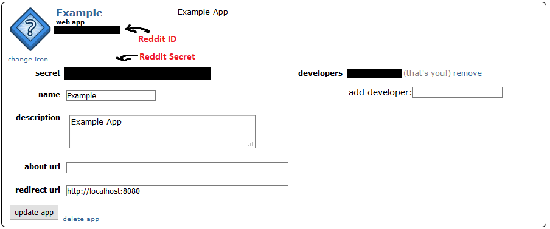
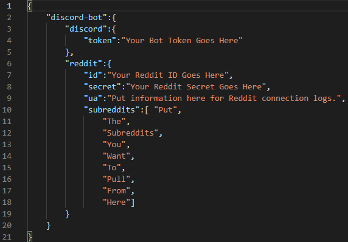
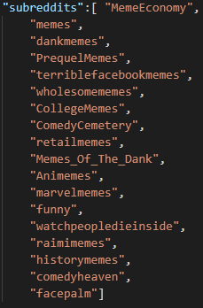

# General Purpose Discord Bot

## Motivation For The Bot
I began creating this Discord Bot because I wanted to create a personal project that I feel I would be able to use in the future. As a casual gamer in my free time, I use Discord quite a bit. Contributing to many different Discord servers, I feel that most Discord bots are very specific in their functions and are not very broad. This can end up with a server having many different Discord bots to do many different things. I wanted to create a bot that is a bit more generalized in its functions. I also wanted to create something that allows anyone to host their own Discord bot. 

## Current Modules
**jsonHandler** : Handles read and write functions to .json files 
**MemeGenerator** : Uses praw python module to pull data from reddit and provide output to RedditCollector class 

## Planned Features
Voice channel bot : The bot will be able to connect to a voice channel and play audio from YouTube. 
Moderation bot : The bot will be able to moderate the Discord server. Warn, kick and ban users for different specified actions. 
 
Additional features will be planned based on future feedback. 

## How To Get Started

### Creating The Bot
You will need to first create a Discord Bot through the Discord Developer Portal. You can follow read through the [guide](https://discordpy.readthedocs.io/en/latest/discord.html) linked. It does a better job explaining the process than I could and it is step by step. Note we will need the Discord Token of your bot later.

### Create A Reddit Application
We also need to create a Reddit Application so we can directly access subreddit information through PRAW. 
Start by going [here](https://ssl.reddit.com/prefs/apps/) and click create another app. 
 
Note down the Reddit ID and Reddit Secret as we will need them later. Where to find that information is shown below. 
 

### Download Project And Edit
Now we need to download the project and create a setup.json file. This file is essential and is needed in order for the bot to run properly. I have included a setup-example.json file shown below.  
 
 
Within the quotes, enter in your Discord Token, Reddit ID and Reddit Secret where asked. In the subbreddit section, put the subreddit name in quotes like shown. For example if you want to pull a meme from **reddit.com/r/funny**, you would put **funny** in the quotes. An example subreddit list is shown below. 
 

**My suggestion would be to edit the setup-example.json file and save it as setup.json**

### Boot Up Your Bot And Invite
Now that the bot should setup properly. Begin running the project and invite the bot to your Discord server. Refer to the previous Discord [guide](https://discordpy.readthedocs.io/en/latest/discord.html) for how to invite the bot to your server.

### Begin Having Fun
The default prefix will be "!". Type !help for the help command to learn what the bot can do. 
 
 
I hope you enjoy the bot and have fun using it for your own server.