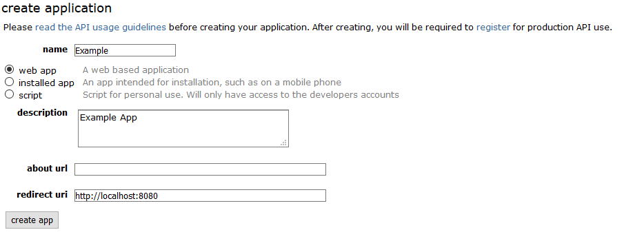
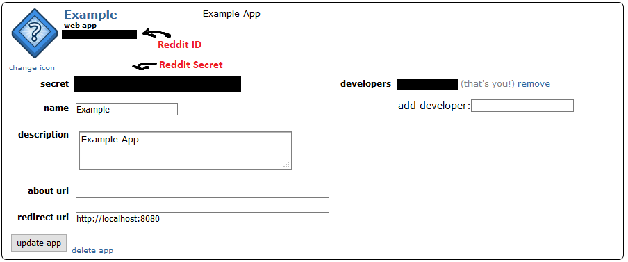

# General Purpose Discord Bot

## Current Modules
**jsonHandler** : Handles read and write functions to .json files
**MemeGenerator** : Uses praw python module to pull data from reddit and provide output to RedditCollector class 

## Planned Features
Voice channel bot : The bot will be able to connect to a voice channel and play audio from YouTube

## How To Get Started

### Creating The Bot
You will need to first create a Discord Bot through the Discord Developer Portal. You can follow read through the [guide](https://discordpy.readthedocs.io/en/latest/discord.html) linked. It does a better job explaining the process than I could and it is step by step. Note we will need the Discord Token of your bot later.

### Create A Reddit Application
We also need to create a Reddit Application so we can directly access subreddit information through PRAW.
Start by going [here](https://ssl.reddit.com/prefs/apps/) and click create another app.

Note down the Reddit ID and Reddit Secret as we will need them later. Where to find that information is shown below.
